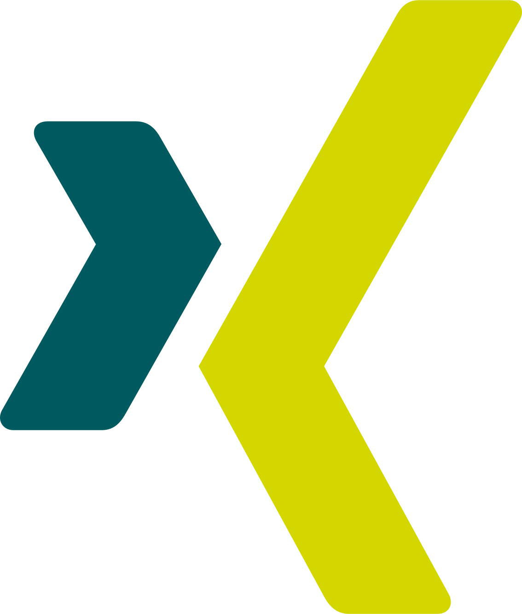
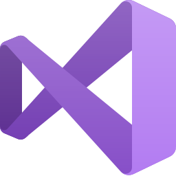

# Hello and Welcome!

- M.Sc. Media Technology (Computer Science) Software Engineer
- Analytical thinker with a creative side
- Experienced in creating intuitive user interfaces and interactive 3D/2D experiences
- Excited to try out- and learn about new things, tech-related or not!

 

Most of my repositories are set to _**Private**_ - Feel free to reach out if you would like a code sample to evaluate.

---

### Other Platforms

&nbsp;&nbsp;

&nbsp;&nbsp;
[][xing]

---

###  Non-Exhaustive Experience List

#### Languages & Frameworks

 
 

#### Tools / Editors / Game Engines

 
 

#### Public Repository Languages

---

[website]: https://luddem.github.io/
[linkedin]: https://www.linkedin.com/in/ludvig-m
[xing]: https://www.xing.com/profile/Ludvig_M/
